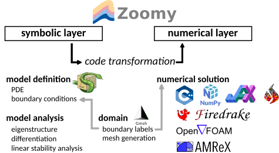

# Zoomy

Flexible modeling and simulation software for free-surface flows.



Zoomy's main objective is to provide a convenient modeling interface for complex free-surface flow models. Zoomy transitions from a **symbolic** modeling layer to **numerical** layer, compatible with a multitude of numerical solvers, e.g. Numpy, Jax, Firedrake, FenicsX, OpenFOAM and AMReX. Additionally, we support the PreCICE coupling framework in many of our numerical implementations, to allow for a convenient integration of our solver with your existing code.

## Documentation

See our [Documentation](https://mbd-rwth.github.io/Zoomy/) for details on

-   how to get started
-   tutorials
-   examples
-   API
-   ...

## License

The Zoomy code is free open-source software, licensed under version 3 or later of the GNU General Public License. See the file [LICENSE](LICENSE) for full copying permissions.

## BibTex Citation

T.b.d.

## Installation

### Getting started in seconds

A good way to have an **interactive** first impression of Zoomy is to use one of the following options

#### JupyterLite

t.b.d

#### Cloud-based GUI

t.b.d.

### Manual installation

#### Cloning the repository

You can either clone the repo with all related subrepositories via

```
git clone --recurse-submodules https://github.com/zoomy-lab/Zoomy.git
```

**or** you can start by cloning the main repository (Zoomy) and selected subrepositories, e.g.

```
git clone https://github.com/zoomy-lab/Zoomy.git
cd Zoomy
git submodule update --init meshes
git submodule update --init library/zoomy_core
git submodule update --init library/zoomy_jax
```

The different subrepositories are listed at [ZoomyLab](https://github.com/zoomy-lab)


#### Installating with Conda/Mamba

The project is composed out of different environment files. We start by installing the base and than adding 'flavors', depdening on the solver backend that you want to use.


**Base Installation**

```         
conda env create -f install/zoomy.yml
```

**Core (Pre/Postprocessing/NumPy solver)**

```         
conda env update -f install/env-core.yml
```

**Unstructured mesh support for Numpy/Jax solver**

```         
conda env update -f install/env-mesh.yml
```

**JAX solver**

```         
conda env update -f install/env-jax.yml
```

**FenicsX solver**

```         
conda env update -f install/env-fenicsx.yml
```

**FenicsX**

```         
conda env update -f install/env-fenicsx.yml
```

#### Firedrake (Linux / Mac)

**Base Installation**

```         
cd install
conda env create -f install/zoomy.yml
./conda_config_setup.sh
```

**Firedrake**

Activate the environment before installing any Firedrake dependencies.

```         
conda activate zoomy
```

Mainly follow the instructions on the [Firedrake Webpage](https://www.firedrakeproject.org/install.html#install-firedrake).

Deviating from the instructions on the webpage, we use

```         
python3 ../firedrake-configure --show-petsc-configure-options --with-pnetcdf=0 | xargs -L1 ./configure
```

to compile PetSc without PNetCDF and then install Firedrake inside our conda environment

```         
pip install --no-binary h5py 'firedrake[check]'
```

#### AMReX (Linux / Mac)

**Base Installation**

```         
cd install
conda env create -f install/zoomy.yml
./conda_config_setup.sh
```

**AMReX**

Note that the AMReX installation is *completely indepdenent* and the AMReX solver does not depend on the Conda/Mamba environment. Follow the instructions on the [AMReX Webpage](https://amrex-codes.github.io/amrex/docs_html/Introduction.html)

#### OpenFOAM 12 (Linux / Mac)

T.b.d

**Activation**

```         
conda activate zoomy
```

### Docker

T.b.d

### Apptainer

T.b.d

### Manual installation

See the `install/*.yml` for a complete list of requirements. Once the requirements are fulfilled, clone this repository and submodules.

The following environment variables need to be set

```{bash}
PYTHONPATH=/path/to/Zoomy
ZOOMY_DIR=/path/to/Zoomy
JAX_ENABLE_X64=True
PETSC_DIR=/path/to/petsc/installation
PETSC_ARCH=architecture used for compiling petsc
```

### External dependencies

#### PreCICE

T.b.d.

### Working in Jupyter Notebooks

Make sure to export the environment variables

```{bash}
PYTHONPATH=/path/to/Zoomy
ZOOMY_DIR=/path/to/Zoomy
JAX_ENABLE_X64=True //(if you use JAX)
PETSC_DIR=/path/to/petsc/installation
PETSC_ARCH=architecture used for compiling petsc
```

## Testing

T.b.d.

## Publications

T.b.d.

## Dependencies and acknowledgements

This
